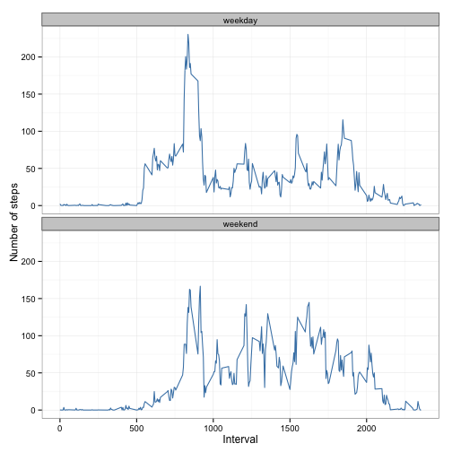

# Reproducible Research: Peer Assessment 1

### Problem background (from assignment):
```
It is now possible to collect a large amount of data about personal movement using activity monitoring devices such as a Fitbit, Nike Fuelband, or Jawbone Up. These type of devices are part of the “quantified self” movement – a group of enthusiasts who take measurements about themselves regularly to improve their health, to find patterns in their behavior, or because they are tech geeks. But these data remain under-utilized both because the raw data are hard to obtain and there is a lack of statistical methods and software for processing and interpreting the data.

This assignment makes use of data from a personal activity monitoring device. This device collects data at 5 minute intervals through out the day. The data consists of two months of data from an anonymous individual collected during the months of October and November, 2012 and include the number of steps taken in 5 minute intervals each day.

Data

The data for this assignment can be downloaded from the course web site:

Dataset: Activity monitoring data [52K]
The variables included in this dataset are:

steps: Number of steps taking in a 5-minute interval (missing values are coded as NA)

date: The date on which the measurement was taken in YYYY-MM-DD format

interval: Identifier for the 5-minute interval in which measurement was taken

The dataset is stored in a comma-separated-value (CSV) file and there are a total of 17,568 observations in this dataset.

```

#### Part1: Loading and preprocessing the data
Show any code that is needed to
- Load the data (i.e. read.csv())
- Process/transform the data (if necessary) into a format suitable for your analysis


```r
# Part 1: solution
activity <- read.csv("activity.csv")
activity$date2 <- as.Date(activity$date, format = "%Y-%m-%d")  #formatted date
```


#### Part2: What is mean total number of steps taken per day?
- For this part of the assignment, you can ignore the missing values in the dataset.
- Make a histogram of the total number of steps taken each day
- Calculate and report the mean and median total number of steps taken per day


```r
#part2: Solution
#daily summary: Do calculations first, then plot and report answers in end

d<- data.frame(unique(activity$date2)) #just the dates for aggregation
names(d)<- "date2" 

for (i in 1:nrow(d)) #loop through each date
{
  t<- activity[activity$date2==d[i,1],1] #store current date in t
  d[i,2]<- sum(t, na.rm = TRUE)   #aggregate and keep adding to data frame d (one value for each date)
  d[i,3]<- mean(t, na.rm = TRUE)
  d[i,4]<- median(t, na.rm = TRUE)
}
names(d)<- c("Date", "Total Steps", "Mean Steps", "Median Steps")

# library(graphics) #load library to plot
```


```r
plot(d[, 1], d[, 2], type = "h", xlab = "Date", ylab = "Total steps", main = "Histogram of total steps each day")
```

 


Data table of mean and median steps each day

```r
print(d[, c(1, 3, 4)])
```

```
##          Date Mean Steps Median Steps
## 1  2012-10-01        NaN           NA
## 2  2012-10-02     0.4375            0
## 3  2012-10-03    39.4167            0
## 4  2012-10-04    42.0694            0
## 5  2012-10-05    46.1597            0
## 6  2012-10-06    53.5417            0
## 7  2012-10-07    38.2465            0
## 8  2012-10-08        NaN           NA
## 9  2012-10-09    44.4826            0
## 10 2012-10-10    34.3750            0
## 11 2012-10-11    35.7778            0
## 12 2012-10-12    60.3542            0
## 13 2012-10-13    43.1458            0
## 14 2012-10-14    52.4236            0
## 15 2012-10-15    35.2049            0
## 16 2012-10-16    52.3750            0
## 17 2012-10-17    46.7083            0
## 18 2012-10-18    34.9167            0
## 19 2012-10-19    41.0729            0
## 20 2012-10-20    36.0938            0
## 21 2012-10-21    30.6285            0
## 22 2012-10-22    46.7361            0
## 23 2012-10-23    30.9653            0
## 24 2012-10-24    29.0104            0
## 25 2012-10-25     8.6528            0
## 26 2012-10-26    23.5347            0
## 27 2012-10-27    35.1354            0
## 28 2012-10-28    39.7847            0
## 29 2012-10-29    17.4236            0
## 30 2012-10-30    34.0938            0
## 31 2012-10-31    53.5208            0
## 32 2012-11-01        NaN           NA
## 33 2012-11-02    36.8056            0
## 34 2012-11-03    36.7049            0
## 35 2012-11-04        NaN           NA
## 36 2012-11-05    36.2465            0
## 37 2012-11-06    28.9375            0
## 38 2012-11-07    44.7326            0
## 39 2012-11-08    11.1771            0
## 40 2012-11-09        NaN           NA
## 41 2012-11-10        NaN           NA
## 42 2012-11-11    43.7778            0
## 43 2012-11-12    37.3785            0
## 44 2012-11-13    25.4722            0
## 45 2012-11-14        NaN           NA
## 46 2012-11-15     0.1424            0
## 47 2012-11-16    18.8924            0
## 48 2012-11-17    49.7882            0
## 49 2012-11-18    52.4653            0
## 50 2012-11-19    30.6979            0
## 51 2012-11-20    15.5278            0
## 52 2012-11-21    44.3993            0
## 53 2012-11-22    70.9271            0
## 54 2012-11-23    73.5903            0
## 55 2012-11-24    50.2708            0
## 56 2012-11-25    41.0903            0
## 57 2012-11-26    38.7569            0
## 58 2012-11-27    47.3819            0
## 59 2012-11-28    35.3576            0
## 60 2012-11-29    24.4688            0
## 61 2012-11-30        NaN           NA
```

Median is all 0 because more than 50% users took 0 steps on all days, which pushed median to 0


#### Part3: What is the average daily activity pattern?
- Make a time series plot (i.e. type = "l") of the 5-minute interval (x-axis) and the average number of steps taken, averaged across all days (y-axis)
- Which 5-minute interval, on average across all the days in the dataset, contains the maximum number of steps?


```r
#part3: interval summary
d<- data.frame(unique(activity$interval)) #just the intervals for aggregation
names(d)<- "interval"

for (i in 1:nrow(d)) #loop through each interval
{
  t<- activity[activity$interval==d[i,1],1] #store current number of steps in t, for current interval
  d[i,2]<- mean(t, na.rm = TRUE) #average steps for line plot
  d[i,3]<- sum(t, na.rm=TRUE) #total steps to calculate max later
}

names(d)<- c("interval", "average_steps", "total_steps")
```


```r
plot(d[, 1], d[, 2], type = "l", xlab = "Interval", ylab = "Average steps", 
    main = "Histogram of average steps in each interval")
```

 


```r
# interval with maximum number of total steps
print(d[d$total_steps == max(d$total_steps), 1])
```

```
## [1] 835
```


#### Part4: Imputing missing values
Note that there are a number of days/intervals where there are missing values (coded as NA). The presence of missing days may introduce bias into some calculations or summaries of the data.
- Calculate and report the total number of missing values in the dataset (i.e. the total number of rows with NAs)
- Devise a strategy for filling in all of the missing values in the dataset. The strategy does not need to be sophisticated. For example, you could use the mean/median for that day, or the mean for that 5-minute interval, etc.
- Create a new dataset that is equal to the original dataset but with the missing data filled in.
- Make a histogram of the total number of steps taken each day and Calculate and report the mean and median total number of steps taken per day. Do these values differ from the estimates from the first part of the assignment? What is the impact of imputing missing data on the estimates of the total daily number of steps?


```r
# Code for part 4
print(c('Number of missing values - ',sum(!complete.cases(activity))))
```

```
## [1] "Number of missing values - " "2304"
```

```r


a<- activity
for (i in 1:nrow(a))
{
  if(is.na(a[i,1])) 
    {
    t<- a[i,3]
    a[i,1]<- d[d[,1]==t,2]
    }
}


d<- data.frame(unique(a$date2)) #just the dates for aggregation
names(d)<- "date2" 

for (i in 1:nrow(d)) #loop through each date
{
  t<- a[a$date2==d[i,1],1] #store current date in t
  d[i,2]<- sum(t, na.rm = TRUE)   #aggregate and keep adding to data frame d (one value for each date)
  d[i,3]<- mean(t, na.rm = TRUE)
  d[i,4]<- median(t, na.rm = TRUE)
}
names(d)<- c("Date", "Total Steps", "Mean Steps", "Median Steps")

```


```r
plot(d[, 1], d[, 2], type = "h", xlab = "Date", ylab = "Total steps", main = "Histogram of total steps each day")
```

 

Please note that values have changed, and mostly increased.


```r
print(d[, c(1, 3, 4)])
```

```
##          Date Mean Steps Median Steps
## 1  2012-10-01    37.3826        34.11
## 2  2012-10-02     0.4375         0.00
## 3  2012-10-03    39.4167         0.00
## 4  2012-10-04    42.0694         0.00
## 5  2012-10-05    46.1597         0.00
## 6  2012-10-06    53.5417         0.00
## 7  2012-10-07    38.2465         0.00
## 8  2012-10-08    37.3826        34.11
## 9  2012-10-09    44.4826         0.00
## 10 2012-10-10    34.3750         0.00
## 11 2012-10-11    35.7778         0.00
## 12 2012-10-12    60.3542         0.00
## 13 2012-10-13    43.1458         0.00
## 14 2012-10-14    52.4236         0.00
## 15 2012-10-15    35.2049         0.00
## 16 2012-10-16    52.3750         0.00
## 17 2012-10-17    46.7083         0.00
## 18 2012-10-18    34.9167         0.00
## 19 2012-10-19    41.0729         0.00
## 20 2012-10-20    36.0938         0.00
## 21 2012-10-21    30.6285         0.00
## 22 2012-10-22    46.7361         0.00
## 23 2012-10-23    30.9653         0.00
## 24 2012-10-24    29.0104         0.00
## 25 2012-10-25     8.6528         0.00
## 26 2012-10-26    23.5347         0.00
## 27 2012-10-27    35.1354         0.00
## 28 2012-10-28    39.7847         0.00
## 29 2012-10-29    17.4236         0.00
## 30 2012-10-30    34.0938         0.00
## 31 2012-10-31    53.5208         0.00
## 32 2012-11-01    37.3826        34.11
## 33 2012-11-02    36.8056         0.00
## 34 2012-11-03    36.7049         0.00
## 35 2012-11-04    37.3826        34.11
## 36 2012-11-05    36.2465         0.00
## 37 2012-11-06    28.9375         0.00
## 38 2012-11-07    44.7326         0.00
## 39 2012-11-08    11.1771         0.00
## 40 2012-11-09    37.3826        34.11
## 41 2012-11-10    37.3826        34.11
## 42 2012-11-11    43.7778         0.00
## 43 2012-11-12    37.3785         0.00
## 44 2012-11-13    25.4722         0.00
## 45 2012-11-14    37.3826        34.11
## 46 2012-11-15     0.1424         0.00
## 47 2012-11-16    18.8924         0.00
## 48 2012-11-17    49.7882         0.00
## 49 2012-11-18    52.4653         0.00
## 50 2012-11-19    30.6979         0.00
## 51 2012-11-20    15.5278         0.00
## 52 2012-11-21    44.3993         0.00
## 53 2012-11-22    70.9271         0.00
## 54 2012-11-23    73.5903         0.00
## 55 2012-11-24    50.2708         0.00
## 56 2012-11-25    41.0903         0.00
## 57 2012-11-26    38.7569         0.00
## 58 2012-11-27    47.3819         0.00
## 59 2012-11-28    35.3576         0.00
## 60 2012-11-29    24.4688         0.00
## 61 2012-11-30    37.3826        34.11
```

Please note that some of the medians are non zero now, because of adjustment for missing values. Since the imputation was done by interval, the aggregation shows comparable values when aggregated by date.

#### Part5: Are there differences in activity patterns between weekdays and weekends?
For this part the weekdays() function may be of some help here. Use the dataset with the filled-in missing values for this part.
- Create a new factor variable in the dataset with two levels – “weekday” and “weekend” indicating whether a given date is a weekday or weekend day.
- Make a panel plot containing a time series plot (i.e. type = "l") of the 5-minute interval (x-axis) and the average number of steps taken, averaged across all weekday days or weekend days (y-axis).


```r
# code for part 5 Define columns in new imputed dataset 'a' for weekday and
# weekend
a$weekday <- weekdays(a$date2)  #Gives which day it is (7 values)
a$w_tf <- a$weekday == "Saturday" | a$weekday == "Sunday"  # Boolean for wekend or weekday
a$wday_flag <- factor(a$w_tf, labels = c("weekday", "weekend"))  #Final column with right formatting

# Create aggregated dataset for weekend vs weekday average steps plot
library(sqldf)
```

```
## Loading required package: gsubfn
## Loading required package: proto
## Loading required namespace: tcltk
## Loading required package: RSQLite
## Loading required package: DBI
## Loading required package: RSQLite.extfuns
```

```r
a_part5 <- sqldf("select wday_flag, interval, avg(steps) as avg_steps\n                from a\n                group by wday_flag, interval")
```

```
## Loading required package: tcltk
```

```r

# Actual plot code
library(ggplot2)
plot_part5 <- function() {
    ggplot(data = a_part5, aes(x = interval, y = avg_steps)) + geom_line(color = "steelblue", 
        size = 0.5) + facet_wrap(~wday_flag, nrow = 2, ncol = 1) + theme_bw() + 
        xlab("Interval") + ylab("Number of steps")
}
plot_part5()
```

 

